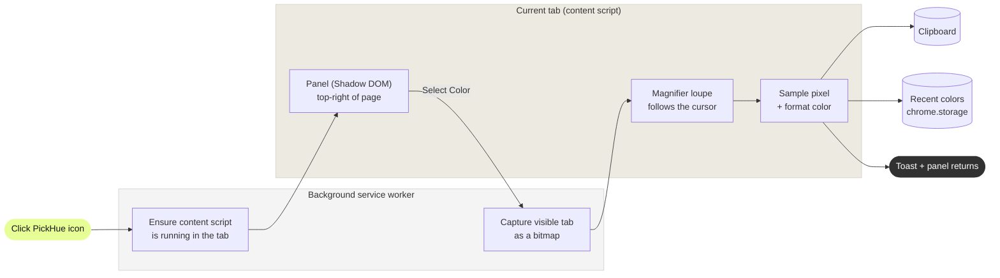

# PickHue

## An elegant, in-page color picker for your browser.

PickHue lets you grab any color on any page with a precise on-screen magnifier, copies it to your clipboard in the format you want, and keeps a tidy history of recent colors — all from a clean panel that lives right on the page.

**Free. No accounts. No tracking. Nothing leaves your machine.**

---

## Features

- 🎯 **Pixel-precise eyedropper** — a circular magnifier loupe follows your cursor so you pick the exact pixel you mean.
- 📋 **Copy in your format** — choose **HEX**, **RGB**, or **HSL**; picks are copied automatically on click.
- 🕘 **Recent colors** — every pick is saved; click any swatch to copy it again, and scroll the row for older picks.
- 🌗 **Light & dark** — toggle the panel theme to taste.
- 🪟 **Real rounded UI** — the interface is injected into the page (like Pocket and Prod), so it gets true rounded corners and shadows instead of the browser's boxy popup.
- 🔒 **Private by design** — the page is sampled locally; no servers, no third parties.

---

## Install

> [!IMPORTANT]
> This is a developer install — it takes about a minute.

**1. Get the files**

```bash
git clone https://github.com/alex-wilczewski/pickhue.git
cd pickhue
```

**2. Build it**

```bash
npm install
npm run build
```

This generates the extension icons and bundles everything into the `dist/` folder.

**3. Open your extensions page**

Go to `brave://extensions` (or `chrome://extensions`).

**4. Enable Developer mode**

Toggle **Developer mode** in the top-right corner.

**5. Load the extension**

Click **Load unpacked** and select the `dist/` folder from this repo.

**6. Pin it**

Click the puzzle-piece icon in the toolbar and pin PickHue so it's always one click away.

---

## How to Use

**TLDR:** Click the PickHue icon → click **Select Color** → click any pixel → it's copied.

**1. Open the panel**
Click the PickHue icon in your toolbar. The panel slides in at the top-right of the page.

**2. Start picking**
Click **Select Color**. The panel steps aside and a magnifier loupe appears under your cursor.

**3. Pick a color**
Move to the pixel you want and click. The color is copied to your clipboard, a toast confirms it, and it's added to the front of **Recent Colors**. Press **Esc** to cancel without picking.

**4. Reuse colors**
Click any recent swatch to copy it again. Scroll the recent-colors row (just hover and scroll) to reach older picks.

---

## Where It Works

The panel and eyedropper run as a content script injected into the page, so they work almost everywhere — but not on pages the browser locks down.

| | Examples |
|---|---|
| **Works** | Regular websites — marketing sites, docs, apps, dashboards, local pages |
| **Can't run** | Browser-internal pages (`chrome://`, `brave://`), the Web Store, and other extension pages |

> [!NOTE]
> On a page where PickHue can't run, clicking the toolbar icon briefly shows an **n/a** badge instead of opening the panel.

---

## How It Works



A couple of details that make it feel right:

- **Shadow DOM isolation.** The panel renders inside a shadow root so the host page's CSS can never leak in and break the design.
- **Accurate sampling.** Clicking the icon captures the visible tab, and the loupe magnifies that bitmap — so the pixel under the reticle is exactly what gets copied.
- **Gesture-safe clipboard.** The copy happens synchronously inside your click, so it works reliably even when the page isn't focused.

---

## Development

```bash
npm run dev        # rebuild on change (load dist/ as an unpacked extension)
npm run build      # production build into dist/
npm run typecheck  # type-check without emitting
```

### Project structure

```
src/
  background/service-worker.ts   # toolbar click → toggle panel; tab capture; saves recents
  content/
    index.ts                     # content entry: wires the panel + eyedropper
    panel.ts / panel.css         # the in-page UI (Shadow DOM)
    picker.ts / picker.css       # the eyedropper magnifier overlay
  shared/                        # colors, storage, clipboard, types
  manifest.ts                    # MV3 manifest
scripts/generate-icons.mjs       # builds PNG icons from the logo SVG
public/icons/logo-mark.svg       # source logo mark
```

### Customizing the logo

The logo mark lives at `public/icons/logo-mark.svg`. The toolbar/extension PNGs are generated from it during the build, so just replace the SVG and run `npm run build`.

---

## Permissions

| Permission | Why |
|---|---|
| `activeTab`, `tabs`, `host_permissions: <all_urls>` | Capture the visible page so colors can be sampled pixel-accurately |
| `scripting` | Inject the panel/eyedropper on pages that were already open before install |
| `storage` | Persist your settings and recent colors |

---

## Roadmap

- [ ] Publish to the Chrome Web Store
- [ ] Landing page for the web product

---

## Tech

TypeScript · Vite · [`@crxjs/vite-plugin`](https://github.com/crxjs/chrome-extension-tools) · Manifest V3 · Shadow DOM · `sharp` (icon generation)

---

## License

[MIT](./LICENSE)
